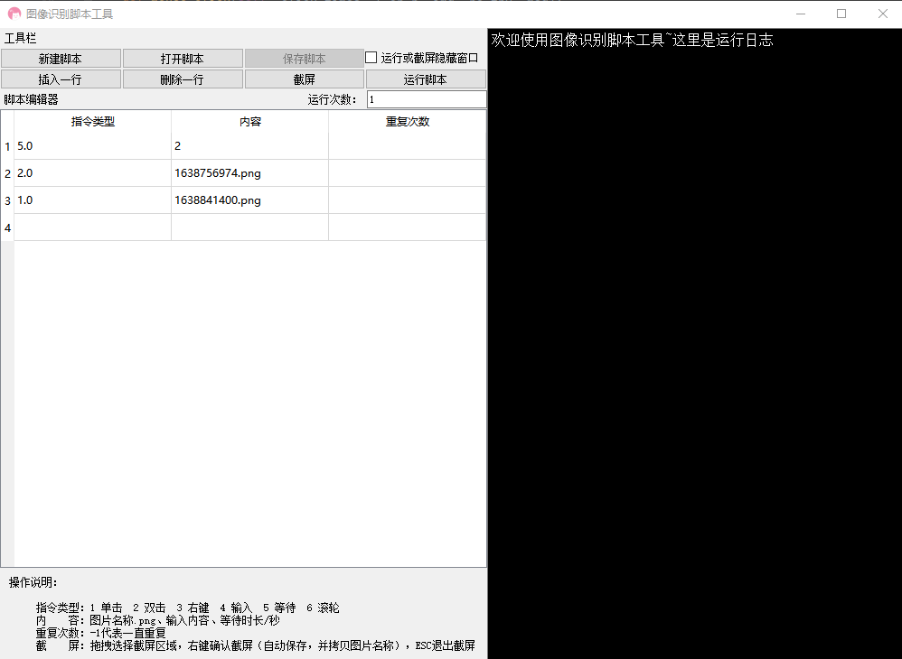
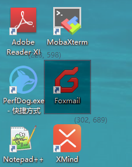

# gui-script-editor
A gui-script-editor(Based on pyqt5, pyautogui) to writing your gui script.

##**更新说明**

版本号：1.0.0

版本说明：实现了脚本编辑器雏形，未实现执行报告，自动化脚本管理（只支持单个脚本运行）

##[免配置环境
app.exe](https://github.com/user-dahai/gui-script-editor/releases)

##源代码运行环境
依赖|版本号
---|---
python|3.7
PyAutoGUI                       |0.9.53
PyQt5                           |5.15.4
xlrd                            |2.0.1
xlwt                            |1.3.0
pyperclip                       |1.8.2
pyinstaller                     |4.7

##文件说明
路径|文件名|窗口截图|文件描述
---|---|---|---
/|app.pyw|无|程序入口，用于打包，.pyw格式运行时不显示黑窗
/|main.py||综合了所有ui和逻辑，是程序入口
---|---|---|---
Action|ScreenShot.py||截屏程序
Action|ScriptRunner.py|无|脚本运行器
---|---|---|---
ScriptThread|RunnerThread.py|无|脚本运行线程
---|---|---|---
Setup|Project.py|无|初始化运行数据，ini文件管理，储存界面上面的选项
---|---|---|---
UI|MainWindows.py |无|主界面
UI|FloatingWin.py ||浮窗
UI|MainLayout.py |无|布局
UI|MainTable.py |无|表格
UI|Delegate.py|无|自定义委托限制输入整数用于表格数据校验
